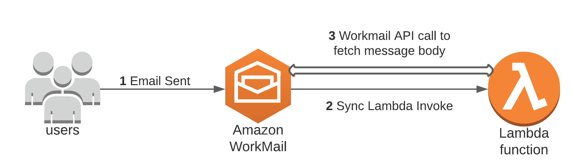
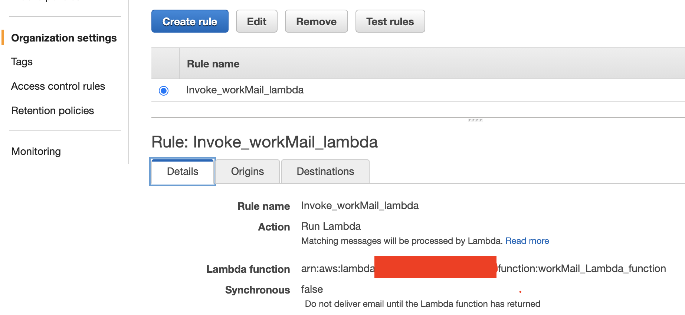
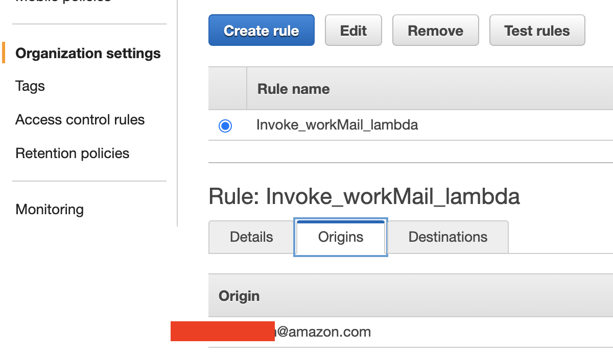
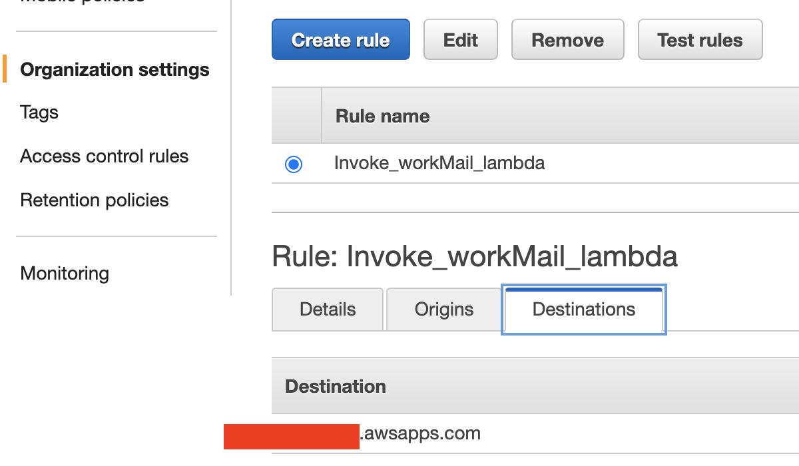
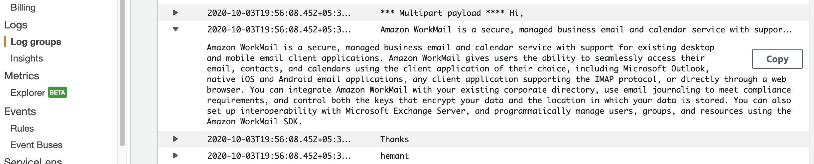

# Amazon Workmail inbound email flow rule to invoke lambda function to fetch email message body as text

## Overview

As announced [here](https://aws.amazon.com/about-aws/whats-new/2020/05/control-your-email-flows-in-amazon-workmail-using-aws-lambda/), inside Amazon Workmail, you can now control email flow of your organization using AWS Lambda functions when using 'email flow rules'. With this, you can build powerful email flow control system with completely customizable conditions.   

In this sample code I am demonstrating how you can setup email flow rule with patterns to invoke a lambda functions for all inbound emails delivered to your domain and how this lambda sample code then can fetch the inbound email message body as text and after that you can use that message body text to perform various operations as per your requirement. I have used 'Python 3.6' as Lambda function's runtime enviorement and sample code is there in the code folder.You can use this sample code to fetch the inbound email message body inside lambda function and with that you can perform various operations as per your requirements. 

## Getting Started

In order to demostrate this functionality, I have used below architecture where once the inbound email is delivered to your Amazon workmail inbox and if the pattern/s matches, it will invoke the rule action which is inovocation of a lambda function in this case. You can use my sample code to fetch the inbound email message body and parse it properly as text. 

### Prerequisites

1. As I have used Python 3.6 as my Lambda function runtime hence some knowledge of python 3 version is required.

### Steps

1. First setup an Amazon workmail site, setup an organization and create a user access by following steps mentioned in 'Getting Started' document [here](https://docs.aws.amazon.com/workmail/latest/adminguide/howto-start.html). Once above setup process is done, you will have access to https://*your Organization*.awsapps.com/mail webmail url and you can login using your created user's username / password to access your emails.

2. Now we will create a lambda function which will be invoked once inbound email reaches the inbox and email flow rule pattern is matched (more on this in below steps). You can use the sample lambda python(3.6) code ( lambda_function.py) provided in the 'code' folder for the same. It will fetch the inbound email message body and then parse it properly to get the message body as text. Once you get it as text you can perform various operations on it.

3. Inbound email flow rules, also called rule actions, automatically apply to all email messages sent to anyone inside of the Amazon WorkMail organization. This differs from email rules for individual mailboxes. Now we will set up email flow rules to handle email flows based on email addresses or domains. Email flow rules are based on both the sender's and recipient's email addresses or domains.

To create an email flow rule, we need to specify a rule action to apply to an email when a specified pattern is matched. Follow the documenttion link [here](https://docs.aws.amazon.com/workmail/latest/adminguide/email-flows.html#email-flows-rule-actions) to create email flow rule for your organization which you created in step #1 above. you have to select Action=Run Lambda for your rule. Below is the email flow rule created by me:

you can now follow documentation link [here](https://docs.aws.amazon.com/workmail/latest/adminguide/email-flows.html#email-flows-patterns) to create pattern/s which need to be satisfied first in order to invoke the rule action (in this case it will invoke our lambda function). For this sample code functionality I have used my email address as pattern in 'origns' and my domain as pattern in 'destinations'. so in this case the lambda function will only be invoke if inbound email sender is my email address and destination is my domain only but you can set patterns as per your requirements. Below screen shots depicts my patterns:

## Running the tests

Now the whole setup is done and in order to test it, I will send an email from my emailId to my newly created Amazon webmail user emailId which falls under my domain. This will make sure that patterns matches for the defined email flow rule and lambda function is invoked.

you can see in below screen shot that my lambda function is printing the parsed text messae body in Amazon cloud watch logs:

## Contributing

Please read [CONTRIBUTING.md](https://gist.github.com/PurpleBooth/b24679402957c63ec426) for details on our code of conduct, and the process for submitting pull requests to us.

## License

This library is licensed under the MIT-0 License. See the LICENSE file.

